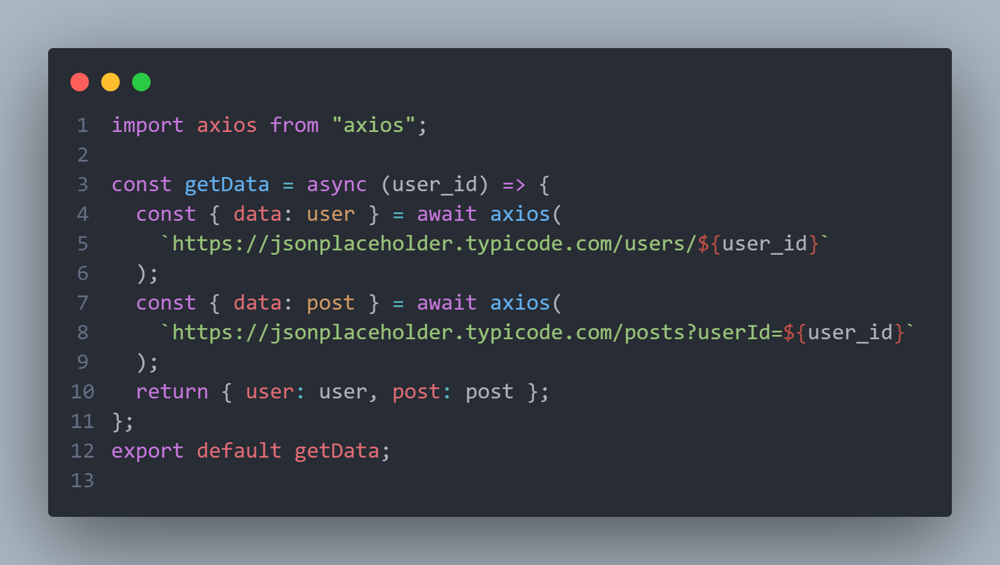
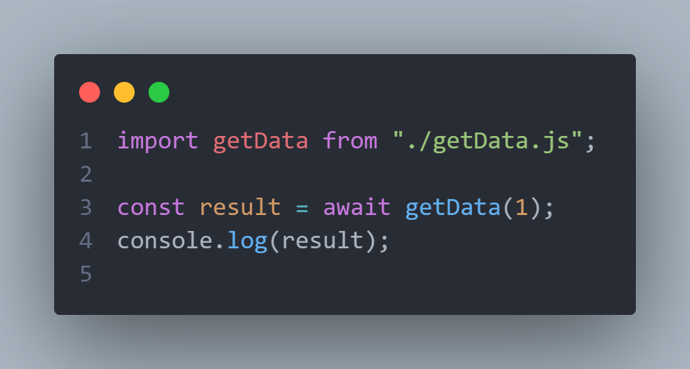

# fetch_api_usage
This module use this endpoints
  https://jsonplaceholder.typicode.com/users
  https://jsonplaceholder.typicode.com/posts



## Usage
1. You should import module
  ```
  import getData from "./getData.js";
  ```


